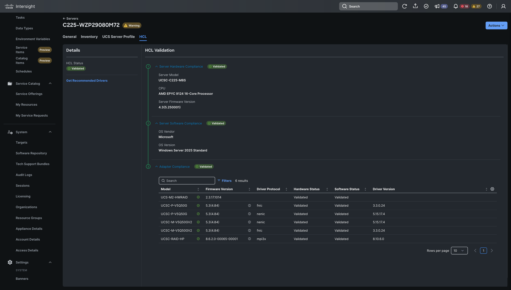

# os-discovery-tool-windows
The Cisco Intersight os-discovery-tool is used to collect operating system and driver information for Hardware Compliance Validation.

Intersight OS Discovery Tool that can run on baremetal hosts and populate driver information in Intersight via IPMI. This tool does NOT require any additional connectivity or remote access unlike the original OS Disovery tool and behaves similar to ESXi ucs-tools.



## Table of Contents

- [Installation](#installation)
- [Usage](#usage)
- [Details](#details)
- [License](#license)
- [Limitations](#limitations)

## Installation
**System Requirements:**
Windows Server 2012+

Privileged account on host that can issue ipmiutil commands and retrieve local inventory


**Host Software Requirements:**

Powershell 7.2+

IPMIUtil 3.1.9+ (https://ipmiutil.sourceforge.net/)


## Usage

Confirm all pre-requisite packages are installed

With a privileged user account run "ucs-tool.ps1 c:\pathto\ipmiutil.exe" manually or setup a scheduled task to run the script at boot and preferably every 24 hours

Check Host HCL status in Intersight to see populate OS & driver info

## Details

Example host-inv.yaml structure:
```
annotations:
 -kv:
  key: os.updateTimestamp
  value: 2025-05-29T15:12:48.423Z
 -kv:
  key: os.vendor
  value: Microsoft
 -kv:
  key: os.name
  value: Windows
 -kv:
  key: os.arch
  value: 64-bit
 -kv:
  key: os.type
  value: Server
 -kv:
  key: os.kernelVersionString
  value: Windows Server 2025 Standard
 -kv:
  key: os.releaseVersionString
  value: Standard
 -kv:
  key: os.updateVersionString
  value: 
 -kv:
  key: os.driver.0.name
  value: fnic
 -kv:
  key: os.driver.0.description
  value: Cisco VIC-FCoE Storport Miniport
 -kv:
  key: os.driver.0.version
  value: 3.3.0.24
 -kv:
  key: os.driver.1.name
  value: nenic
 -kv:
  key: os.driver.1.description
  value: Cisco VIC Ethernet Interface
 -kv:
  key: os.driver.1.version
  value: 5.15.17.4
 -kv:
  key: os.driver.2.name
  value: mpi3x
 -kv:
  key: os.driver.2.description
  value: Cisco Tri-Mode 24G SAS RAID Controller w/4GB Cache
 -kv:
  key: os.driver.2.version
  value: 8.10.6.0
 -kv:
  key: os.driver.3.name
  value: ahci
 -kv:
  key: os.driver.3.description
  value: Standard SATA AHCI Controller
 -kv:
  key: os.driver.3.version
  value: 10.0.26100.1150
 -kv:
  key: os.InvEndKey
  value: InvEndValue
```

IPMI Command Structure
```
Delete File - 0x36 0x77 0x03 [hex-filename]
  Example Delete host-inv.yaml - ipmiutil cmd -d 0x36 0x77 0x03 0x68 0x6f 0x73 0x74 0x2d 0x69 0x6e 0x76 0x2e 0x79 0x61 0x6d 0x6c

Open and Retrieve File Descriptor - 0x36 0x77 0x00 [hex-filename]
  Example Get host-inv.yaml file descriptor - ipmiutil cmd -d 0x36 0x77 0x00 0x68 0x6f 0x73 0x74 0x2d 0x69 0x6e 0x76 0x2e 0x79 0x61 0x6d 0x6c
  IPMI will return file descriptor eg 0x08
 
Write Data to File - 0x36 0x77 0x02 [hex-filedescriptor] [hex-payload length] [hex-litle endian starting point in file] [hex-payload]
  Example write 1's (0x31) and 2's (0x32) starting at byte 40 in the host-inv.yaml file - ipmiutil cmd -d 0x36 0x77 0x02 0x03 0x14 0x28 0x00 0x00 0x00 0x31 0x31 0x31 0x31 0x31 0x31 0x31 0x31 0x31 0x32 0x32 0x32 0x32 0x32 0x32 0x32 0x32 0x32 0x32 0x0A
  
Close File Descriptor - 0x36 0x77 0x01 [hex-filedescriptor]
  Example close file ipmiutil cmd -d 0x36 0x77 0x01 0x08